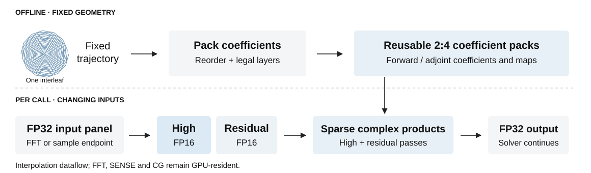

# TrajTC

**Trajectory-aware NUFFT on 2:4 Sparse Tensor Cores.**

[Quick start](#quick-start) · [Reproduction](docs/REPRODUCE.md) · [Design](docs/DESIGN.md) · [Results](docs/RESULTS.md) · [Data](docs/DATASET.md)

TrajTC accelerates iterative non-Cartesian MRI reconstruction by adapting
fixed-trajectory interpolation to NVIDIA Sparse Tensor Cores. Nearby samples
share interpolation support: grouping and rearranging these coefficients
produces legal 2:4 layouts without pruning the stored matrix.

Fixed geometry is packed once; changing inputs receive precision recovery on
every call. An FP16 high component and an FP16 residual component share the
same coefficient pack and accumulate in FP32. Custom FFT endpoints, SENSE,
and CG updates complete the GPU-resident reconstruction.



## Results at a glance

| Evaluation | Reference result |
|---|---|
| Complete reconstruction | **2.51×** over tuned native cuFINUFFT; 95% CI **[2.48,&nbsp;2.54]** |
| Sparse-execution attribution | **1.41×** over the matched, equal-quality dense Tensor Core control |
| Reconstruction quality | **27/27** cases pass; worst magnitude NRMSE **0.19%** against FP32 reconstruction |

Measured on an RTX PRO 6000 Blackwell with 256×256 images, a 512×512 grid,
eight coils, and ten CG steps. Timing covers the complete device-resident
reconstruction **with precomputed packs**; transfers, packing, and planning
are excluded. The intended workload reuses a fixed trajectory, rather than
paying the preparation cost for a single reconstruction.

The external comparison and internal sparse/dense attribution are separate
experiments. Exact values, eager/Graph results, numerical diagnostics, and
their sources are in [Results](docs/RESULTS.md) and the
[machine-readable evidence](evidence/frozen_results.json).

## Quick start

Clone the existing repository URL, retained after the TrajTC rename:

```bash
git clone https://github.com/fanna1234/TrajSparseNUFFT.git TrajTC
cd TrajTC
```

With Python 3.10+ and [uv](https://docs.astral.sh/uv/getting-started/installation/),
check the artifact without a GPU or MRI data:

```bash
./reproduce.sh smoke
./reproduce.sh evidence
```

`smoke` tests lossless packing, adjointness, export consistency, reproduction
routing, and failure handling. `evidence` verifies the committed source hashes
and result record; **it does not run new GPU measurements**.

For GPU reproduction, follow the [environment setup](docs/REPRODUCE.md#environment),
then use the same entry point throughout:

```bash
./reproduce.sh doctor
./reproduce.sh get-data
./reproduce.sh prepare-data
source reproduced-data/layout.env
./reproduce.sh quality
./reproduce.sh baseline-quality
./reproduce.sh main-performance
```

Preparation downloads no hidden fixtures: the three OCMR objects have explicit
URLs and checksums. Builds and validation use the configured Python environment.
Every group supports `--dry-run`; fresh results never overwrite a nonempty run.
See the [full command map](docs/REPRODUCE.md#command-map) for the matched dense
control, sanitizer checks, and longer CG runs.

## Code organization

| Location | Responsibility |
|---|---|
| [`experiments/production/`](experiments/production/) | Production CUDA kernels, FFT endpoints, and complete CG |
| [`experiments/packing/`](experiments/packing/) | Coefficient-preserving forward/adjoint packs |
| [`experiments/cufinufft_baseline/`](experiments/cufinufft_baseline/) | Native external baseline, admitted before timing |
| [`experiments/dense_control/`](experiments/dense_control/) | Equal-quality Tensor Core attribution control |
| [`src/`](src/) and [`tests/`](tests/) | CPU structural oracles, exporters, and regression tests |
| [`reproduce.sh`](reproduce.sh) and [`tools/`](tools/) | Environment, data preparation, and result checks |
| [`evidence/`](evidence/) | Frozen summaries and retained negative diagnostics |

The production binary has no runtime cuFFT dependency. cuFINUFFT and the dense
control remain explicit comparisons, not hidden production fallbacks.

## Scope and licensing

The supported implementation is specialized to SM120a and the shape above.
Validation uses three **retrospective** OCMR acquisitions; it establishes
application-level agreement, not bitwise, prospective, or clinical equivalence.
The [design notes](docs/DESIGN.md) explain the precision and reuse boundaries.

Project code uses the [MIT license](LICENSE). OCMR data is not redistributed
and retains its upstream CC BY-NC 4.0 terms. Third-party code is fetched from
[pinned upstream revisions](experiments/baselines/baselines.lock.json), with
its original licensing intact.
